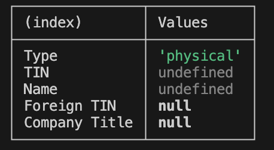
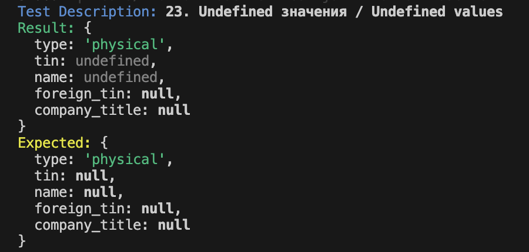
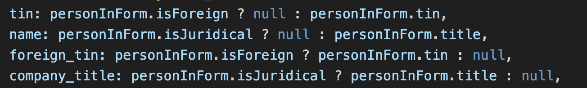
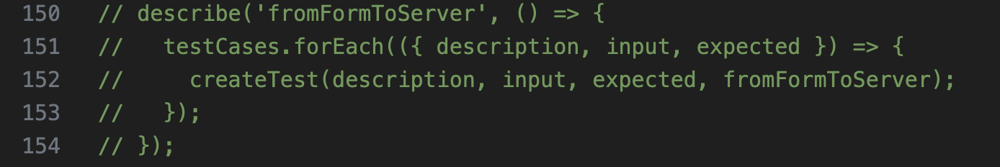

## Оглавление

1. [Описание задания](#описание-задания)
2. [Запуск тестов](#запуск-тестов)
3. [Баг](#баг)
4. [Фикс бага](#фикс-бага)

## Описание задание

В приложении существует форма редактирования контрагента. Контрагент может быть отечественным или иностранным (булевое поле isForeigh), физическим лицом или юридическим (булевое поле isJuridical), а также имеет строковые поля title (название/имя) и tin (ИНН).

На сервере данные представляются в другом виде. Для отечественных контрагентов ИНН должен быть указан в поле tin, для иностранных — в поле foreign_tin. Имя физического лица должно быть указано в поле name, название юридического лица — в поле company_title. Поле тип должно содержать один из вариантов: "juridical", "physical", "foreign_juridical" или "foreign_physical". При этом все поля должны присутствовать в объекте. Незаполненные поля должны иметь значение null.

Перед отправкой на сервер, форма проходит конвертацию при помощи функции:

```js
const fromFormToServer = personInForm => ({
  type: [
    personInForm.isForeign ? null : 'foreign',
    personInForm.isJuridical ? 'juridical' : 'physical',
  ].filter(Boolean).join('_'),
  tin: personInForm.isForeigh ? null : personInForm.tin,
  name: personInForm.isJuridical ? null : personInForm.title,
  foreign_tin: personInForm.isForeign ? personInForm.tin : null,
  company_title: personInForm.isJuridical ? personInForm.title : null,
})
```

Валидация полей происходит до конвертации, так что можем предполагать, что в функцию приходят точно валидные данные.

Необходимо составить unit-тесты для библиотеки Jest или Vitest, которые покрывали бы как можно больше разных случаев. Желательно — все случаи преобразования.

## Запуск тестов

После клонирования репозитория необходимо установить зависимости с помощью:

```
npm install
```

И далее уже запустить тесты:

```
npm test
```

Результат тестирования будет выведен в консоль

## Баг

В ходе тестирования функции конвертации был замечен следующщий баг:

*Если вдруг во все 4 поля придет `undefined`, то в `null` преобразован он будет только в `foreign_tin` и `company_title`, а в остальных 2 полях (`type` и `tin`) останется `undefined`, хотя ожидается, что в `null` будут преобразовываться все 4 поля*





## Фикс бага

В  текущей реализации функции `fromFormToServer` поля `tin` и `name` обрабатываются таким образом, что они могут остаться `undefined`, если переданные значения из объекта `personInForm` не определены.



- Поле `tin` будет `null`, если `personInForm.isForeign` истинно, в противном случае оно получит значение из `personInForm.tin`, которое может быть `undefined`, если не определено.

- Поле `name` будет `null`, если `personInForm.isJuridical` истинно, в противном случае оно получит значение из `personInForm.title`, которое также может быть `undefined`, если не определено.

- Поле `foreign_tin` будет `null`, если `personInForm`.`isForeign` ложно, в противном случае оно получит значение из `personInForm.tin`.

- Поле `company_title` будет `null`, если `personInForm.isJuridical` ложно, в противном случае оно получит значение из `personInForm.title`.

Чтобы гарантировать, что все поля, которые могут принимать `undefined`, заменяются на `null`, нужно добавить дополнительную проверку на `undefined`:

```js
tin: personInForm.isForeign ? null : (personInForm.tin !== undefined ? personInForm.tin : null),
    name: personInForm.isJuridical ? null : (personInForm.title !== undefined ? personInForm.title : null),
    foreign_tin: personInForm.isForeign ? (personInForm.tin !== undefined ? personInForm.tin : null) : null,
    company_title: personInForm.isJuridical ? (personInForm.title !== undefined ? personInForm.title : null) : null,
```

Так мы устраним потенциальную ошибку.

В папке src лежит два файла: `fromFormToServer.js` и `fromFormToServerFix.js` в первом исходная функция, а во втором исправленная.



Раскомментировав данные строчки, можно будет запустить тесты для исходной функции и убедиться, что на 23-ем тесте все падает.
